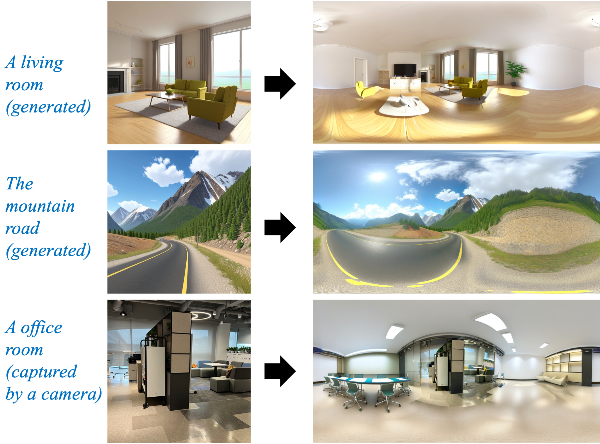

# SD-T2I-360PanoImage
repository for [**Diffusion360: Seamless 360 Degree Panoramic Image Generation based on Diffusion Models** ](https://arxiv.org/pdf/2311.13141.pdf)

## News!!!
- 2024.5.20. I recommend to install 0.20.0<= diffusers <= 0.26.0. The higher diffusers version will get an over-saturated SR result.
- 2024.5.17. A ComfyUI plugin of this repo is released!
See https://github.com/ArcherFMY/Diffusion360_ComfyUI for more information

## Text-to-360Panorama
# 
# 
# 

## Single-Image-to-360Panorama
# 

## Requirements
- torch
- torchvision
- torchaudio
- diffusers
- accelerate
- xformers
- triton
- transformers
- realesrgan
- py360convert


## Installation
```
git clone https://github.com/ArcherFMY/SD-T2I-360PanoImage.git
cd SD-T2I-360PanoImage
pip install -r requirements.txt
```

## Getting Started
### Download Models
Download models from [Baidu Disk](https://pan.baidu.com/s/1i_ypdWHknp2kqbjl0_zAuw?pwd=w2vr). Unzip `models.zip` into the root directory of the project.
```
${ROOT}  
|-- data  
|   |-- a-living-room.png
|   |...
|-- models  
|   |-- sd-base
|   |-- sr-base
|   |-- sr-control
|   |-- RealESRGAN_x2plus.pth
|-- txt2panoimg
|-- img2panoimg
|...
```

For users who want the Single-Image-to-360Panorama models, please download the additional models from [Baidu Disk](https://pan.baidu.com/s/1kJxXeMXLASYjMThDPl50xQ?pwd=tput), and unzip it into the 'models' directory.
Or download the models from [Hugging Face](https://huggingface.co/archerfmy0831/sd-t2i-360panoimage)


### Inference
#### Text-to-360Panorama
```
import torch
from txt2panoimage import Text2360PanoramaImagePipeline

prompt = 'The living room'
input = {'prompt': prompt, 'upscale': False}
model_id = './models'
txt2panoimg = Text2360PanoramaImagePipeline(model_id, torch_dtype=torch.float16)
output = txt2panoimg(input)

output.save('result.png')
```
see more in `demo_t2p.py`

#### Single-Image-to-360Panorama
```
import torch
from diffusers.utils import load_image
from img2panoimg import Image2360PanoramaImagePipeline

image = load_image("./data/i2p-image.jpg").resize((512, 512))
mask = load_image("./data/i2p-mask.jpg")
prompt = 'The office room'
input = {'prompt': prompt, 'image': image, 'mask': mask, 'upscale': False}
model_id = 'models'
img2panoimg = Image2360PanoramaImagePipeline(model_id, torch_dtype=torch.float16)
output = img2panoimg(input)

output.save('result.png')
```
see more in `demo_i2p.py`


### Use Text-to-360Panorama in ModelScope
see [here](https://www.modelscope.cn/models/damo/cv_diffusion_text-to-360panorama-image_generation/summary) for more information.

## License

This code is released under the Apache License 2.0 (refer to the LICENSE file for details).


